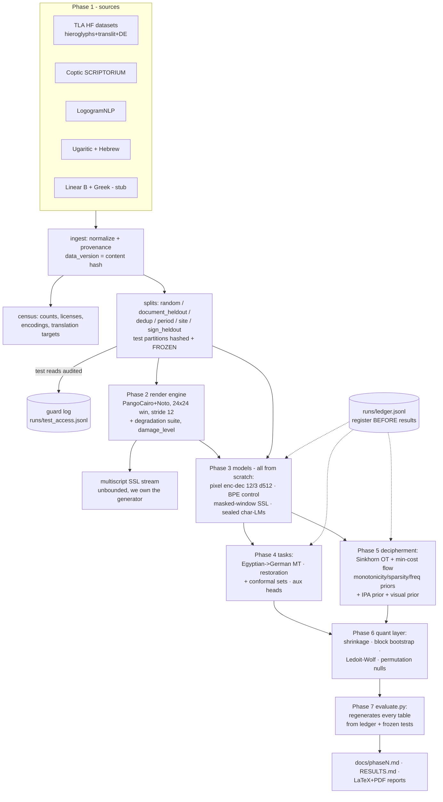

# architecture.md — dataset pipeline & system dataflow

## Dataflow



## Data directory contract (normative — the guard depends on it)

```
data/
  <corpus>/                      # e.g. tla_earlier_egyptian, coptic_scriptorium
    raw/                         # exactly as downloaded, never modified
    processed/<data_version>/    # normalized jsonl; dir hash = data_version
    splits/<scheme>/<version>/   # scheme in {random, document_heldout, dedup,
      train/                     #   period_heldout, site_heldout, sign_heldout}
      valid/
      test/                      # <- every read below a test/ dir is audited
    private/                     # keys/answer material (artificial decipherment)
```

- `data/` is gitignored; identity lives in content hashes recorded in the
  census and in every ledger entry (`data_version`, `split_version`).
- Test partitions are frozen at split time; Phase 1 adds a manifest the guard
  will enforce against (Phase 0 guard is audit-only).
- Render cache (Phase 2) is keyed by `(text_hash, render_config_hash)` and is
  regenerable — never data of record.

## Run lifecycle (every phase, same shape — established by the smoke pipeline)

1. resolve config (strict dataclass) → `config_hash`
2. `guard.install_guard()`; `set_seed(cfg.seed)`
3. materialize/verify data → `data_version`, `split_version`
4. `ledger.register(hypothesis, family, ...)` — BEFORE any result
5. train / fit on `train`, select on `valid`
6. score on locked `test` (audited), attach `all_metrics`
7. terminal ledger event (`completed`/`failed`/`abandoned`)
8. `glyphos-ledger report` — winner only reportable with its family
   distribution

Reference implementation: `glyphos/tasks/smoke.py`.
